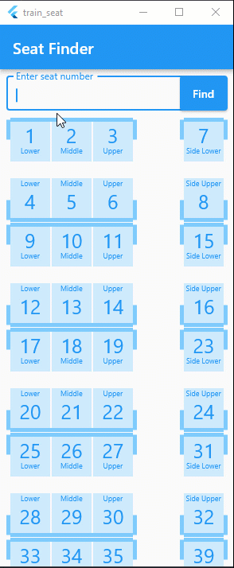

# train_seat

Indian train seat finder in flutter



### lib directory
```
│   main.dart
│
├───bloc
│       seat_finder_bloc.dart    
│       seat_finder_event.dart   
│       seat_finder_state.dart   
│
├───constants
│       colors.dart
│       seat_type.dart
│       sizes.dart
│
└───pages
    └───seat_finder
        │   seat_finder_page.dart
        │   
        └───components
                seat_handle_widget.dart
                seat_row_widget.dart
                single_seat_box_widget.dart
```